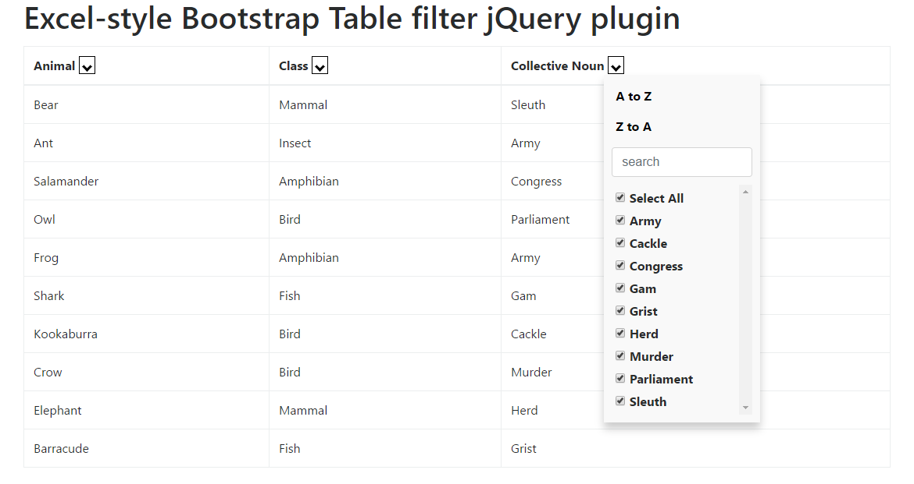

= Excel Bootstrap Table Filter jQuery Plugin

A jQuery plugin to generate an excel-flavored table-filter.

[[img-calendar]]
.Excel Table Filter Example

== Usage

. Install the dependencies by running: `npm install`.
. Build the project by running: `npm run build`.
. Add `dist/checkbox-dropdown-plugin.min.js` and `dist/checkbox-dropdown-style.css` to you project
. Render the dropdown to a `#table` and pass an (optional) configuration object:

    $('#table').excelTableFilter({
        columnSelector: '.apply-filter',    // (optional) if present, will only select <th> with specified class
        sort: true,                         // (optional) default true
        search: true                        // (optional) default true
        captions: Object                    // (optional) default { a_to_z: 'A to Z', z_to_a: 'Z to A', search: 'Search', select_all: 'Select All' }
    });
. Add 'no-sort', 'no-filter' or 'no-search' to <th> element to customize its dropdown.

== Support

This plugin uses some methods like `Array.prototype.map`, `Array.prototype.reduce`, `Array.prototype.indexOf` that may need a polyfill in IE.

